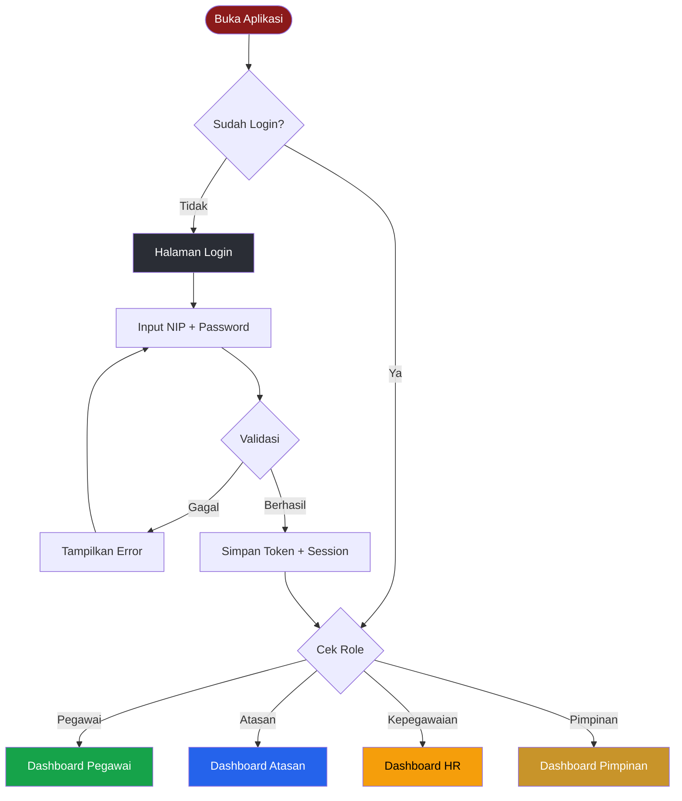
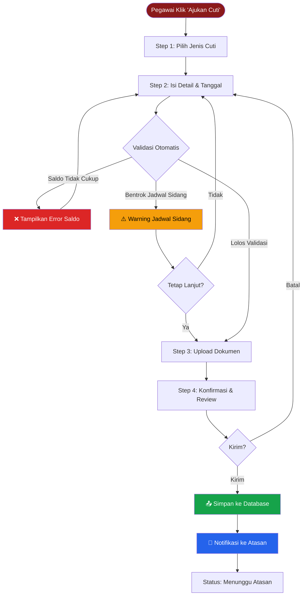
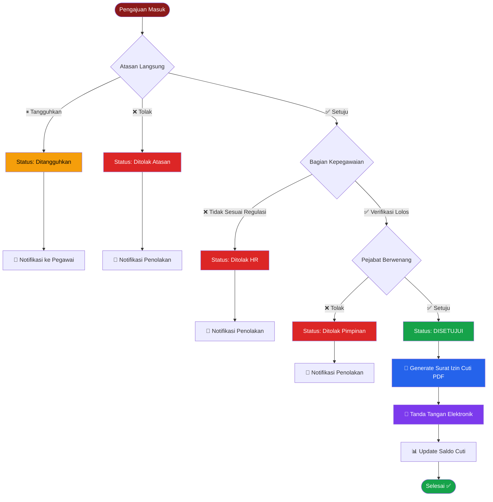
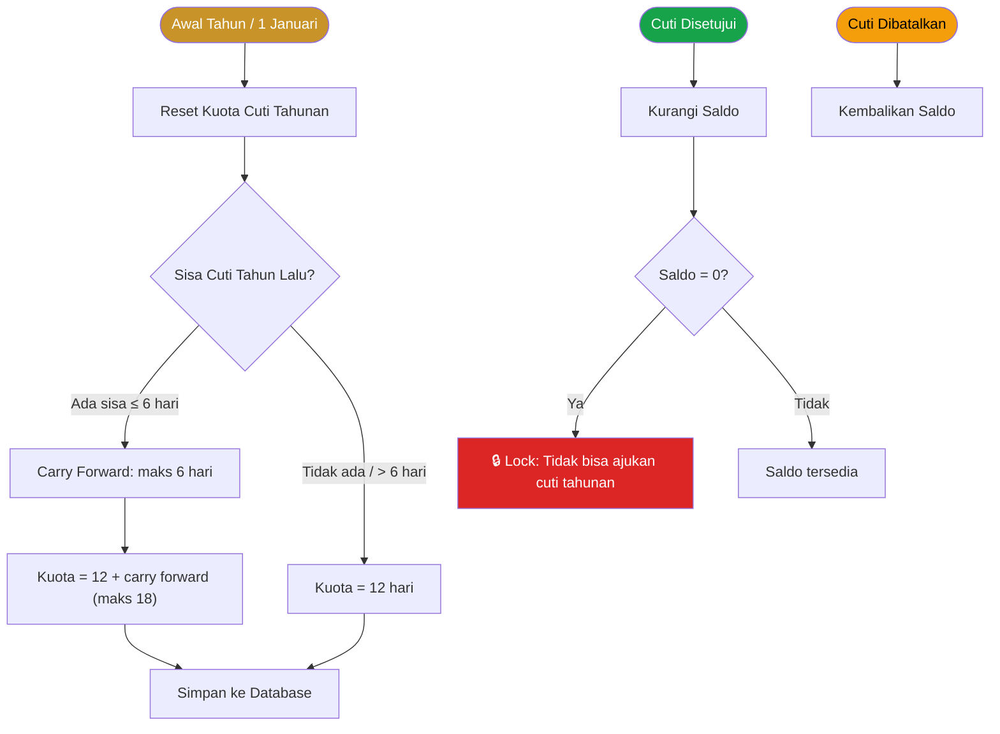
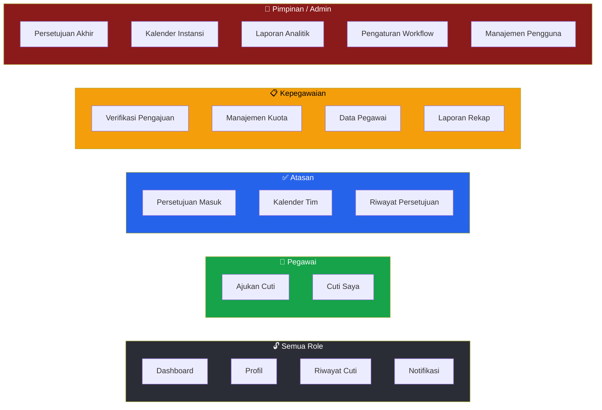
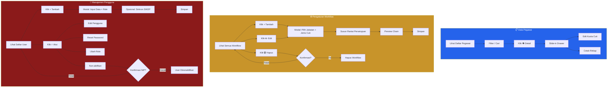
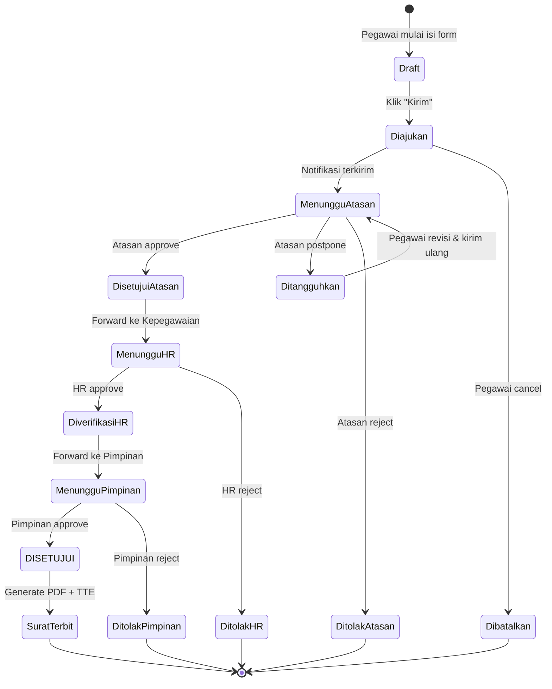
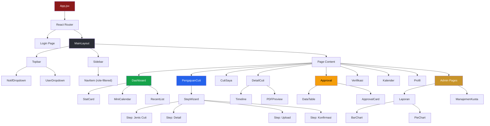
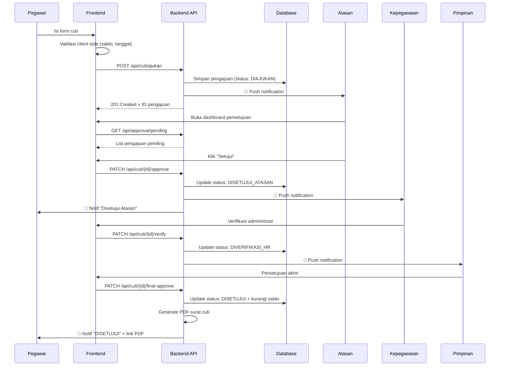

# Sistem Informasi Cuti — Wireframes & Flowcharts

---

## 1. Application Flow Diagrams

### 1.1 Autentikasi & Routing



---

### 1.2 Alur Pengajuan Cuti (Leave Request Flow)



---

### 1.3 Workflow Engine — Alur Persetujuan Multi-Level



---

### 1.4 Manajemen Kuota Cuti



---

### 1.5 Navigasi Per-Role



---

## 2. ASCII Wireframes — Semua Halaman

### 2.1 Login

```
╔══════════════════════════════════════════════════════════════════╗
║                                                                  ║
║          ░░░░░░░░░░░░░░░░░░░░░░░░░░░░░░░░░░░                    ║
║          ░  Background: Maroon Gradient     ░                    ║
║          ░  + Vanta.js Wave Animation       ░                    ║
║          ░                                  ░                    ║
║          ░   ╔══════════════════════════╗    ░                    ║
║          ░   ║                          ║    ░                    ║
║          ░   ║     ┌──────────────┐     ║    ░                    ║
║          ░   ║     │  ⚖️  LOGO    │     ║    ░                    ║
║          ░   ║     │  PN KEDIRI   │     ║    ░                    ║
║          ░   ║     └──────────────┘     ║    ░                    ║
║          ░   ║                          ║    ░                    ║
║          ░   ║   SISTEM INFORMASI CUTI  ║    ░                    ║
║          ░   ║   Pengadilan Negeri      ║    ░                    ║
║          ░   ║   Kediri Kelas I-B       ║    ░                    ║
║          ░   ║                          ║    ░                    ║
║          ░   ║   NIP                    ║    ░                    ║
║          ░   ║   ┌──────────────────┐   ║    ░                    ║
║          ░   ║   │ 19XXXXXXXXXXXX   │   ║    ░                    ║
║          ░   ║   └──────────────────┘   ║    ░                    ║
║          ░   ║                          ║    ░                    ║
║          ░   ║   Password               ║    ░                    ║
║          ░   ║   ┌──────────────────┐   ║    ░                    ║
║          ░   ║   │ ••••••••    👁   │   ║    ░                    ║
║          ░   ║   └──────────────────┘   ║    ░                    ║
║          ░   ║                          ║    ░                    ║
║          ░   ║   [✓] Ingat Saya         ║    ░                    ║
║          ░   ║                          ║    ░                    ║
║          ░   ║   ┌──────────────────┐   ║    ░                    ║
║          ░   ║   │     M A S U K    │   ║    ░                    ║
║          ░   ║   └──────────────────┘   ║    ░                    ║
║          ░   ║                          ║    ░                    ║
║          ░   ║    Lupa Password?         ║    ░                    ║
║          ░   ║                          ║    ░                    ║
║          ░   ╚══════════════════════════╝    ░                    ║
║          ░   Card: Glassmorphism             ░                    ║
║          ░   backdrop-filter: blur(20px)     ░                    ║
║          ░░░░░░░░░░░░░░░░░░░░░░░░░░░░░░░░░░░                    ║
║                                                                  ║
╚══════════════════════════════════════════════════════════════════╝
```

---

### 2.2 Master Layout (Sidebar + Topbar)

```
╔═══════════════════════════════════════════════════════════════════════╗
║ TOPBAR  h:56px  bg:#1A1D23                                          ║
║ ┌────┬─────────────────────────────────────────┬────┬──────────────┐ ║
║ │ ☰  │ ⚖️ SIC — Pengadilan Negeri Kediri       │ 🔔3│ 👤 A.Fauzi ▾│ ║
║ └────┴─────────────────────────────────────────┴────┴──────────────┘ ║
╠════════╦══════════════════════════════════════════════════════════════╣
║ SIDEBAR║  MAIN CONTENT                                              ║
║ w:240px║                                                            ║
║        ║  Breadcrumb: Dashboard > ...                               ║
║ ┌────┐ ║  ════════════════════════════════════                      ║
║ │LOGO│ ║                                                            ║
║ └────┘ ║  ┌────────────────────────────────────────────────────┐    ║
║        ║  │                                                    │    ║
║ ───────║  │            PAGE CONTENT AREA                       │    ║
║ 📊 Dash║  │                                                    │    ║
║   board║  │       (Konten berubah sesuai route)                │    ║
║        ║  │                                                    │    ║
║ 📝 Aju-║  │                                                    │    ║
║   kan  ║  │                                                    │    ║
║        ║  │                                                    │    ║
║ 📋 Cuti║  │                                                    │    ║
║   Saya ║  │                                                    │    ║
║        ║  └────────────────────────────────────────────────────┘    ║
║ 👤 Pro-║                                                            ║
║   fil  ║                                                            ║
║        ║  ┌────────────────────────────────────────────────────┐    ║
║ 📅 Kal-║  │ Footer: © 2026 Pengadilan Negeri Kediri Kelas I-B │    ║
║   ender║  └────────────────────────────────────────────────────┘    ║
║        ║                                                            ║
║ ───────║                                                            ║
║ 🚪 Log-║                                                            ║
║   out  ║                                                            ║
╚════════╩══════════════════════════════════════════════════════════════╝
```

**Collapsed (64px):**
```
╔════╦═══════════════════════════════════╗
║    ║                                   ║
║ 📊 ║   Content area lebih lebar        ║
║ 📝 ║                                   ║
║ 📋 ║   Icon-only sidebar               ║
║ 👤 ║   Tooltip on hover                ║
║ 📅 ║                                   ║
║    ║                                   ║
║ 🚪 ║                                   ║
╚════╩═══════════════════════════════════╝
```

---

### 2.3 Dashboard — Pegawai

```
┌─────────────────────────────────────────────────────────────────┐
│  Selamat Pagi, Ahmad Fauzi 👋                                   │
│  NIP: 199201012020011001 │ Staf Umum │ Bagian Umum & Keuangan  │
├─────────────────────────────────────────────────────────────────┤
│                                                                 │
│  KUOTA CUTI                                                     │
│  ┌──────────────┐ ┌──────────────┐ ┌──────────────┐ ┌────────┐│
│  │ 📅 TAHUNAN   │ │ 📋 BESAR     │ │ 🏥 SAKIT     │ │ 📤 AKT-││
│  │              │ │              │ │              │ │   IF   ││
│  │    8/12      │ │   90/90      │ │   2 hari     │ │   2    ││
│  │ ┌────────┐  │ │ ┌────────┐  │ │              │ │pending ││
│  │ │████░░░░│  │ │ │████████│  │ │  terpakai    │ │        ││
│  │ └────────┘  │ │ └────────┘  │ │              │ │        ││
│  │ sisa 8 hari │ │ belum pakai │ │              │ │        ││
│  └──────────────┘ └──────────────┘ └──────────────┘ └────────┘│
│                                                                 │
│  ┌─────────────────────────────┐ ┌─────────────────────────┐   │
│  │ 📋 PENGAJUAN TERAKHIR       │ │ 📅 KALENDER MARET 2026  │   │
│  │                             │ │                         │   │
│  │  CT-2026-0042               │ │  Se Se Ra Ka Ju Sa Mi   │   │
│  │  Cuti Tahunan               │ │                    1    │   │
│  │  28 Mar – 1 Apr (3 hari)    │ │   2  3  4  5  6  7  8  │   │
│  │  ⏳ Pending — Kasubag       │ │   9 10 11 12 13 14 15  │   │
│  │  ─────────────────────────  │ │  16 17 18 19 20 21 22  │   │
│  │  CT-2026-0038               │ │  23 24 25 26 27[28 29] │   │
│  │  Cuti Sakit                 │ │  30[31]                 │   │
│  │  10–11 Feb (2 hari)         │ │                         │   │
│  │  ✅ Disetujui               │ │  [██] = hari cuti Anda  │   │
│  │                             │ │  merah = libur nasional │   │
│  │  [Lihat Semua →]            │ │                         │   │
│  └─────────────────────────────┘ └─────────────────────────┘   │
│                                                                 │
│  ┌─────────────────────────────────────────────────────────┐   │
│  │            [ + AJUKAN CUTI BARU ]                       │   │
│  │            btn: bg #8B1A1A, full-width, h:48px          │   │
│  └─────────────────────────────────────────────────────────┘   │
└─────────────────────────────────────────────────────────────────┘
```

---

### 2.4 Dashboard — Atasan

```
┌─────────────────────────────────────────────────────────────────┐
│  Dashboard Persetujuan — Ir. Suyanto (Kasubag Umum)            │
├─────────────────────────────────────────────────────────────────┤
│                                                                 │
│  ┌────────────────┐ ┌────────────────┐ ┌────────────────┐      │
│  │ 🟡 MENUNGGU    │ │ 🟢 DISETUJUI   │ │ 🔴 DITOLAK     │      │
│  │                │ │                │ │                │      │
│  │      5         │ │     12         │ │      1         │      │
│  │   (pulse)      │ │  bulan ini     │ │  bulan ini     │      │
│  └────────────────┘ └────────────────┘ └────────────────┘      │
│                                                                 │
│  PENGAJUAN MASUK (Perlu Tindakan)                               │
│  ┌─────────────────────────────────────────────────────────┐   │
│  │ ┌─────────────────────────────────────────────────────┐ │   │
│  │ │ 👤 Ahmad Fauzi — Staf Umum              28 Mar '26 │ │   │
│  │ │ Cuti Tahunan: 28 Mar – 1 Apr 2026 (3 hari kerja)  │ │   │
│  │ │ Alasan: Keperluan keluarga                         │ │   │
│  │ │ Pengganti: Siti Rahayu                             │ │   │
│  │ │ Sisa kuota: 8 hari                                 │ │   │
│  │ │                                                     │ │   │
│  │ │ [✅ Setujui]  [⏸ Tangguhkan]  [❌ Tolak]  [👁 Detail]│ │   │
│  │ └─────────────────────────────────────────────────────┘ │   │
│  │                                                         │   │
│  │ ┌─────────────────────────────────────────────────────┐ │   │
│  │ │ 👤 Budi Santoso — Panitera Pengganti    26 Mar '26 │ │   │
│  │ │ Cuti Sakit: 26 – 27 Mar 2026 (2 hari kerja)       │ │   │
│  │ │ ┌───────────────────────────────────────────────┐  │ │   │
│  │ │ │ ⚠️ PERINGATAN: Jadwal sidang 27 Mar 2026      │  │ │   │
│  │ │ │ Perkara No. 45/Pdt.G/2026 jam 09:00           │  │ │   │
│  │ │ └───────────────────────────────────────────────┘  │ │   │
│  │ │ [✅ Setujui]  [⏸ Tangguhkan]  [❌ Tolak]  [👁 Detail]│ │   │
│  │ └─────────────────────────────────────────────────────┘ │   │
│  └─────────────────────────────────────────────────────────┘   │
│                                                                 │
│  KALENDER TIM — Maret 2026                                      │
│  ┌─────────────────────────────────────────────────────────┐   │
│  │ Nama          │24│25│26│27│28│29│30│31│ 1│ 2│ 3│       │   │
│  │───────────────┼──┼──┼──┼──┼──┼──┼──┼──┼──┼──┼──│       │   │
│  │ A. Fauzi      │  │  │  │  │██│██│██│██│██│  │  │       │   │
│  │ B. Santoso    │  │  │██│██│  │  │  │  │  │  │  │       │   │
│  │ S. Rahayu     │  │  │  │  │  │  │  │  │  │  │  │       │   │
│  │ C. Dewi       │  │  │  │  │  │  │  │  │  │  │  │       │   │
│  └─────────────────────────────────────────────────────────┘   │
│  ██ = cuti                                                      │
└─────────────────────────────────────────────────────────────────┘
```

---

### 2.5 Form Pengajuan Cuti — Step-by-Step

**Step Indicator:**
```
┌─────────────────────────────────────────────────────────────────┐
│                                                                 │
│   ●━━━━━━━━●━━━━━━━━○━━━━━━━━○                                 │
│   Jenis    Detail   Dokumen  Konfirmasi                        │
│   Cuti                                                          │
│                                                                 │
│   ● = selesai (hijau)   ● = aktif (maroon)   ○ = belum        │
└─────────────────────────────────────────────────────────────────┘
```

**Step 1 — Pilih Jenis:**
```
┌─────────────────────────────────────────────────────────────────┐
│  Pilih Jenis Cuti                                               │
│                                                                 │
│  ┌─────────────┐  ┌─────────────┐  ┌─────────────┐            │
│  │   📅        │  │   📋        │  │   🏥         │            │
│  │             │  │             │  │              │            │
│  │   CUTI      │  │   CUTI      │  │   CUTI       │            │
│  │   TAHUNAN   │  │   BESAR     │  │   SAKIT      │            │
│  │             │  │             │  │              │            │
│  │  Sisa: 8 hr │  │ Sisa: 90 hr │  │  —           │            │
│  │  ─────────  │  │  ─────────  │  │              │            │
│  │  [SELECTED] │  │             │  │              │            │
│  └─────────────┘  └─────────────┘  └─────────────┘            │
│                                                                 │
│  ┌─────────────┐  ┌─────────────┐  ┌─────────────┐            │
│  │   🤱        │  │   ⚡        │  │   📝         │            │
│  │             │  │             │  │              │            │
│  │   CUTI      │  │   CUTI      │  │   CLTN       │            │
│  │   MELAHIR-  │  │   ALASAN    │  │              │            │
│  │   KAN       │  │   PENTING   │  │  Di Luar     │            │
│  │             │  │             │  │  Tanggungan   │            │
│  │  Maks: 3 bl │  │  —          │  │  Negara      │            │
│  └─────────────┘  └─────────────┘  └─────────────┘            │
│                                                                 │
│  Card style: border 2px solid transparent                       │
│  Selected: border 2px solid #8B1A1A + shadow + scale(1.02)     │
│  Disabled (syarat tak terpenuhi): opacity 0.5, cursor not-allow│
│                                                                 │
│                               [Selanjutnya →]                   │
└─────────────────────────────────────────────────────────────────┘
```

**Step 2 — Detail:**
```
┌─────────────────────────────────────────────────────────────────┐
│  Detail Pengajuan — Cuti Tahunan                                │
│                                                                 │
│  ┌─────────────────────────┐ ┌─────────────────────────┐       │
│  │ Tanggal Mulai        📅 │ │ Tanggal Selesai      📅 │       │
│  │ [28 Maret 2026       ] │ │ [1 April 2026        ] │       │
│  └─────────────────────────┘ └─────────────────────────┘       │
│                                                                 │
│  Durasi: 3 hari kerja (auto-calc, exclude weekend & libur)     │
│                                                                 │
│  ┌───────────────────────────────────────────────────┐         │
│  │ Alamat Selama Cuti                                │         │
│  │ [Jl. Brawijaya No. 12, Kediri                   ] │         │
│  └───────────────────────────────────────────────────┘         │
│  ┌───────────────────────────────────────────────────┐         │
│  │ No. Telp yang Bisa Dihubungi                      │         │
│  │ [0812-XXXX-XXXX                                 ] │         │
│  └───────────────────────────────────────────────────┘         │
│  ┌───────────────────────────────────────────────────┐         │
│  │ Alasan Cuti                                       │         │
│  │ [Keperluan keluarga                             ] │         │
│  │ [                                               ] │         │
│  └───────────────────────────────────────────────────┘         │
│                                                                 │
│  Pegawai Pengganti:                                             │
│  ┌───────────────────────────────────────────────────┐         │
│  │ 🔍 [Cari nama atau NIP...                       ] │         │
│  └───────────────────────────────────────────────────┘         │
│  → Siti Rahayu (NIP: 199503152021012001) ✓ Tersedia            │
│                                                                 │
│  ┌───────────────────────────────────────────────────┐         │
│  │ ⚡ VALIDASI OTOMATIS                              │         │
│  │                                                   │         │
│  │  ✅ Saldo cuti mencukupi (sisa 8 dari 12 hari)    │         │
│  │  ✅ Tidak bentrok jadwal sidang                    │         │
│  │  ✅ Pegawai pengganti tersedia                     │         │
│  │  ✅ Tidak overlapping dengan cuti lain              │         │
│  └───────────────────────────────────────────────────┘         │
│                                                                 │
│  [← Kembali]                          [Selanjutnya →]          │
└─────────────────────────────────────────────────────────────────┘
```

---

### 2.6 Detail & Tracking Cuti (Timeline)

```
┌─────────────────────────────────────────────────────────────────┐
│  📋 Detail Pengajuan CT-2026-0042                               │
│                                                                 │
│  ┌──────────────────────────────────────┐                      │
│  │ Jenis     : Cuti Tahunan            │                      │
│  │ Tanggal   : 28 Maret – 1 April 2026 │                      │
│  │ Durasi    : 3 hari kerja            │                      │
│  │ Pengaju   : Ahmad Fauzi             │                      │
│  │ Pengganti : Siti Rahayu             │                      │
│  └──────────────────────────────────────┘                      │
│                                                                 │
│  PROGRESS PERSETUJUAN:                                          │
│  ●━━━━━━━━━━●━━━━━━━━━━◉━━━━━━━━━━○                           │
│  Diajukan    Atasan    HR        Pimpinan                      │
│  25 Mar      26 Mar    (proses)  (belum)                       │
│                                                                 │
│  TIMELINE:                                                      │
│  ┌──────────────────────────────────────────────────────┐      │
│  │                                                      │      │
│  │  ● 25 Mar 2026 — 09:15                               │      │
│  │  │ 📤 Pengajuan cuti berhasil dikirim                │      │
│  │  │                                                   │      │
│  │  ● 25 Mar 2026 — 09:15                               │      │
│  │  │ 🔔 Notifikasi terkirim ke Kasubag Umum            │      │
│  │  │                                                   │      │
│  │  ● 26 Mar 2026 — 14:30                               │      │
│  │  │ ✅ Disetujui oleh Ir. Suyanto (Kasubag Umum)      │      │
│  │  │    Catatan: "Silakan, koordinasi dgn pengganti"   │      │
│  │  │                                                   │      │
│  │  ● 26 Mar 2026 — 14:31                               │      │
│  │  │ 🔔 Notifikasi terkirim ke Bag. Kepegawaian        │      │
│  │  │                                                   │      │
│  │  ◉ Menunggu — Verifikasi Kepegawaian                 │      │
│  │  │ (estimasi 1-2 hari kerja)                         │      │
│  │  │                                                   │      │
│  │  ○ Belum — Persetujuan Pimpinan                      │      │
│  │                                                      │      │
│  └──────────────────────────────────────────────────────┘      │
│                                                                 │
│  ┌──────────────────┐  ┌───────────────────┐                   │
│  │ 📄 Download PDF  │  │ ❌ Batalkan Cuti   │                   │
│  │ (jika approved)  │  │ (jika pending)    │                   │
│  └──────────────────┘  └───────────────────┘                   │
└─────────────────────────────────────────────────────────────────┘
```

---

### 2.7 Halaman Laporan & Analitik

```
┌─────────────────────────────────────────────────────────────────┐
│  📊 Laporan & Analitik Cuti                                     │
│                                                                 │
│  Tahun: [2026 ▾]  Bulan: [Semua ▾]  Unit: [Semua ▾]  [📥 Exp] │
│                                                                 │
│  ┌──────────────────────────────┐ ┌─────────────────────────┐  │
│  │  📊 TREN CUTI BULANAN       │ │  🥧 DISTRIBUSI JENIS    │  │
│  │                              │ │                         │  │
│  │  12│       ██                │ │     ┌────────┐          │  │
│  │  10│    ██ ██                │ │    ╱ Tahunan ╲ 65%      │  │
│  │   8│ ██ ██ ██ ██            │ │   │  Sakit    │ 20%     │  │
│  │   6│ ██ ██ ██ ██            │ │    ╲ Lainnya ╱ 15%      │  │
│  │   4│ ██ ██ ██ ██ ██         │ │     └────────┘          │  │
│  │   2│ ██ ██ ██ ██ ██         │ │                         │  │
│  │   0└──────────────────      │ │  ■ Tahunan   ■ Sakit    │  │
│  │    Jan Feb Mar Apr May      │ │  ■ Melahirkan ■ CAP     │  │
│  └──────────────────────────────┘ └─────────────────────────┘  │
│                                                                 │
│  ┌─────────────────────────────────────────────────────────┐   │
│  │ REKAP CUTI PER PEGAWAI                                  │   │
│  ├────┬──────────────┬────┬────┬────┬────┬────┬────────────┤   │
│  │ No │ Nama         │ TH │ BS │ SK │ ML │ CAP│ Total Hari │   │
│  ├────┼──────────────┼────┼────┼────┼────┼────┼────────────┤   │
│  │ 1  │ Ahmad Fauzi  │  4 │  0 │  2 │  0 │  0 │     6      │   │
│  │ 2  │ Budi Santoso │  3 │  0 │  0 │  0 │  0 │     3      │   │
│  │ 3  │ Citra Dewi   │  0 │  0 │  0 │ 90 │  0 │    90      │   │
│  │ 4  │ Siti Rahayu  │  6 │  0 │  1 │  0 │  2 │     9      │   │
│  ├────┴──────────────┴────┴────┴────┴────┴────┴────────────┤   │
│  │ Halaman: [< 1 2 3 ... 5 >]    Tampilkan: [10 ▾] baris  │   │
│  └─────────────────────────────────────────────────────────┘   │
│                                                                 │
│  [📄 Export PDF]   [📊 Export Excel]   [🖨 Cetak]              │
└─────────────────────────────────────────────────────────────────┘
```

---

### 2.8 Notifikasi Panel (Dropdown)

```
                                              ┌──────────────────────────────┐
                                              │ 🔔 Notifikasi (3 baru)       │
                                              ├──────────────────────────────┤
                                              │                              │
                                              │ ● 🟡 Pengajuan CT-0042      │
                                              │   sedang diverifikasi HR     │
                                              │   2 jam lalu                 │
                                              │ ──────────────────────────── │
                                              │ ● 🟢 Cuti 10-11 Feb         │
                                              │   DISETUJUI oleh KPN        │
                                              │   3 hari lalu               │
                                              │ ──────────────────────────── │
                                              │ ○ 🔴 Cuti Besar DITOLAK     │
                                              │   Masa kerja belum 5 tahun  │
                                              │   1 minggu lalu             │
                                              │ ──────────────────────────── │
                                              │                              │
                                              │ [Tandai Semua Dibaca]        │
                                              │ [Lihat Semua Notifikasi →]   │
                                              └──────────────────────────────┘
                                              Max-height: 400px, scrollable
                                              Width: 360px
                                              Shadow: elevated
```

---

### 2.9 Mobile Layout (<768px)

```
┌───────────────────────┐
│ ☰  SIC PN Kediri  🔔  │  ← Topbar (sticky)
├───────────────────────┤
│                       │
│  Selamat Pagi, Ahmad  │
│                       │
│  ┌─────────────────┐  │
│  │ 📅 Tahunan 8/12 │  │  ← Single column
│  │ ████████░░░░░░░ │  │    stat cards
│  └─────────────────┘  │
│  ┌─────────────────┐  │
│  │ 📋 Besar  90/90 │  │
│  │ ████████████████ │  │
│  └─────────────────┘  │
│                       │
│  PENGAJUAN TERAKHIR   │
│  ┌─────────────────┐  │
│  │ CT-0042 Tahunan │  │
│  │ 28 Mar – 1 Apr  │  │
│  │ ⏳ Pending       │  │
│  └─────────────────┘  │
│                       │
│  ┌─────────────────┐  │
│  │[+ AJUKAN CUTI  ]│  │  ← FAB
│  └─────────────────┘  │
│                       │
├───────────────────────┤
│ 📊   📝   🔔   👤    │  ← Bottom Tab Nav
│Dash  Cuti Notif Profil│
└───────────────────────┘
```

---

### 2.10 Data Pegawai (Kepegawaian / Admin)

```
┌─────────────────────────────────────────────────────────────────────────┐
│  👥 Data Pegawai                                                        │
│                                                                         │
│  ┌──────────────────────────────────────────────────────────────────┐  │
│  │ 🔍 [Cari nama atau NIP...                                     ] │  │
│  └──────────────────────────────────────────────────────────────────┘  │
│                                                                         │
│  Filter:                                                                │
│  Unit: [Semua ▾]  Jabatan: [Semua ▾]  Status: [Aktif ▾]  [🔄 Reset]  │
│                                                                         │
│  ┌───────────────────────────────────────────────────────────────┐     │
│  │  Total: 47 pegawai                          [📥 Export] [🖨]  │     │
│  ├────┬──────────────┬─────────────────┬────────────┬──────┬─────┤     │
│  │ No │ Nama ↕       │ NIP ↕           │ Jabatan ↕  │Unit ↕│ ⚡  │     │
│  ├────┼──────────────┼─────────────────┼────────────┼──────┼─────┤     │
│  │ 1  │ Ahmad Fauzi  │ 199201012020..  │ Staf       │Umum  │ [👁]│     │
│  │ 2  │ Budi Santoso │ 198805132019..  │ Panitera   │Hukum │ [👁]│     │
│  │    │              │                 │ Pengganti  │      │     │     │
│  │ 3  │ Citra Dewi   │ 199107222020..  │ Staf       │Kepeg.│ [👁]│     │
│  │ 4  │ Dian Pratama │ 198512012015..  │ Hakim      │  —   │ [👁]│     │
│  │ 5  │ Eko Wahyudi  │ 199003102018..  │ Kasubag    │Umum  │ [👁]│     │
│  │    │              │                 │ Umum       │      │     │     │
│  │ 6  │ Fitri Ayu    │ 199208152021..  │ PPNPN      │IT    │ [👁]│     │
│  │ 7  │ Galih S.     │ 198709052016..  │ Juru Sita  │  —   │ [👁]│     │
│  │ 8  │ Heni Kusuma  │ 199405012022..  │ Staf       │Keu.  │ [👁]│     │
│  ├────┴──────────────┴─────────────────┴────────────┴──────┴─────┤     │
│  │ Halaman: [< 1  2  3  4  5  6 >]      Tampilkan: [10 ▾] baris │     │
│  └───────────────────────────────────────────────────────────────┘     │
│                                                                         │
│  Keterangan:                                                            │
│  ↕ = kolom bisa di-sort (ascending/descending)                         │
│  [👁] = buka detail pegawai (slide-in drawer dari kanan)               │
└─────────────────────────────────────────────────────────────────────────┘
```

**Detail Pegawai — Slide-in Drawer (klik 👁):**
```
                        ┌──────────────────────────────────────┐
                        │  ✕                                   │
                        │  ┌──────┐                            │
                        │  │ FOTO │  Ahmad Fauzi               │
                        │  │      │  NIP: 199201012020011001   │
                        │  └──────┘  Status: Aktif ✅           │
                        │                                      │
                        │  ═══════════════════════════════     │
                        │  INFORMASI JABATAN                   │
                        │  ─────────────────                   │
                        │  Jabatan    : Staf                   │
                        │  Unit       : Sub Bagian Umum        │
                        │  Golongan   : III/a                  │
                        │  TMT Jabatan: 01 Januari 2020        │
                        │  Masa Kerja : 6 tahun 2 bulan        │
                        │  Atasan     : Ir. Suyanto (Kasubag)  │
                        │                                      │
                        │  ═══════════════════════════════     │
                        │  KUOTA CUTI 2026                     │
                        │  ─────────────────                   │
                        │  ┌──────────┬─────┬──────┬──────┐   │
                        │  │ Jenis    │ Hak │Pakai │ Sisa │   │
                        │  ├──────────┼─────┼──────┼──────┤   │
                        │  │ Tahunan  │ 18  │  10  │   8  │   │
                        │  │ Besar    │ 90  │   0  │  90  │   │
                        │  │ Sakit    │  —  │   2  │   —  │   │
                        │  │ Melahir. │  —  │   0  │   —  │   │
                        │  └──────────┴─────┴──────┴──────┘   │
                        │                                      │
                        │  ═══════════════════════════════     │
                        │  RIWAYAT CUTI TERBARU                │
                        │  ─────────────────                   │
                        │  • 10-11 Feb 2026 — Sakit (2hr) ✅   │
                        │  • 28 Mar-1 Apr — Tahunan (3hr) ⏳   │
                        │                                      │
                        │  [Lihat Riwayat Lengkap →]           │
                        │                                      │
                        │  ═══════════════════════════════     │
                        │  AKSI                                │
                        │  ┌──────────────┐ ┌──────────────┐  │
                        │  │ ✏️ Edit Kuota │ │ 📄 Cetak     │  │
                        │  │              │ │    Rekap     │  │
                        │  └──────────────┘ └──────────────┘  │
                        └──────────────────────────────────────┘
                        Width: 420px
                        Slide-in dari kanan, 300ms ease
                        Backdrop: overlay semi-transparent
```

---

### 2.11 Pengaturan Workflow (Admin)

```
┌─────────────────────────────────────────────────────────────────────────┐
│  ⚙️ Pengaturan Alur Persetujuan (Workflow)                              │
│                                                                         │
│  ┌──────────────────────────────────────────────────────────────────┐  │
│  │ ℹ️ Atur rantai persetujuan untuk setiap kombinasi jabatan dan    │  │
│  │    jenis cuti. Perubahan berlaku untuk pengajuan baru.           │  │
│  └──────────────────────────────────────────────────────────────────┘  │
│                                                                         │
│  ┌────────────────────────────────────────────────────────────────┐    │
│  │ WORKFLOW AKTIF                                    [+ Tambah]   │    │
│  ├────────────────────────────────────────────────────────────────┤    │
│  │                                                                │    │
│  │  ┌──────────────────────────────────────────────────────────┐  │    │
│  │  │ 📋 Workflow #1 — Staf → Cuti Tahunan / Sakit            │  │    │
│  │  │                                                          │  │    │
│  │  │  Berlaku untuk:                                          │  │    │
│  │  │  Jabatan: [Staf, PPNPN]   Jenis Cuti: [Tahunan, Sakit]  │  │    │
│  │  │                                                          │  │    │
│  │  │  Rantai Persetujuan:                                     │  │    │
│  │  │  ┌──────────┐    ┌──────────────┐    ┌──────────────┐   │  │    │
│  │  │  │ Pengaju  │ →  │ Kasubag      │ →  │ Kepegawaian  │   │  │    │
│  │  │  │ (auto)   │    │ (atasan      │    │ (verifikasi) │   │  │    │
│  │  │  │          │    │  langsung)   │    │              │   │  │    │
│  │  │  └──────────┘    └──────────────┘    └──────────────┘   │  │    │
│  │  │                                                          │  │    │
│  │  │  [✏️ Edit]  [📋 Duplikat]  [🗑️ Hapus]                    │  │    │
│  │  └──────────────────────────────────────────────────────────┘  │    │
│  │                                                                │    │
│  │  ┌──────────────────────────────────────────────────────────┐  │    │
│  │  │ 📋 Workflow #2 — Staf → Cuti Besar / Melahirkan / CLTN  │  │    │
│  │  │                                                          │  │    │
│  │  │  Berlaku untuk:                                          │  │    │
│  │  │  Jabatan: [Staf, PPNPN]   Jenis: [Besar, Melahirkan,   │  │    │
│  │  │                                    CLTN, Alasan Penting] │  │    │
│  │  │                                                          │  │    │
│  │  │  Rantai Persetujuan:                                     │  │    │
│  │  │  ┌────────┐  ┌────────┐  ┌───────────┐  ┌───────────┐  │  │    │
│  │  │  │Pengaju │→ │Kasubag │→ │Kepegawaian│→ │Ketua PN   │  │  │    │
│  │  │  │(auto)  │  │        │  │           │  │(KPN)      │  │  │    │
│  │  │  └────────┘  └────────┘  └───────────┘  └───────────┘  │  │    │
│  │  │                                                          │  │    │
│  │  │  [✏️ Edit]  [📋 Duplikat]  [🗑️ Hapus]                    │  │    │
│  │  └──────────────────────────────────────────────────────────┘  │    │
│  │                                                                │    │
│  │  ┌──────────────────────────────────────────────────────────┐  │    │
│  │  │ 📋 Workflow #3 — Hakim → Semua Jenis Cuti               │  │    │
│  │  │                                                          │  │    │
│  │  │  Berlaku untuk:                                          │  │    │
│  │  │  Jabatan: [Hakim]   Jenis Cuti: [Semua]                 │  │    │
│  │  │                                                          │  │    │
│  │  │  Rantai Persetujuan:                                     │  │    │
│  │  │  ┌────────┐    ┌───────────┐    ┌───────────┐           │  │    │
│  │  │  │Pengaju │ →  │Kepegawaian│ →  │Ketua PN   │           │  │    │
│  │  │  │(auto)  │    │           │    │(KPN)      │           │  │    │
│  │  │  └────────┘    └───────────┘    └───────────┘           │  │    │
│  │  │                                                          │  │    │
│  │  │  ⚠️ Hakim langsung ke Kepegawaian (tanpa Kasubag)        │  │    │
│  │  │                                                          │  │    │
│  │  │  [✏️ Edit]  [📋 Duplikat]  [🗑️ Hapus]                    │  │    │
│  │  └──────────────────────────────────────────────────────────┘  │    │
│  │                                                                │    │
│  │  ┌──────────────────────────────────────────────────────────┐  │    │
│  │  │ 📋 Workflow #4 — Panitera/PP → Semua Jenis Cuti         │  │    │
│  │  │                                                          │  │    │
│  │  │  Berlaku untuk:                                          │  │    │
│  │  │  Jabatan: [Panitera, Panitera Pengganti, Juru Sita]     │  │    │
│  │  │  Jenis Cuti: [Semua]                                    │  │    │
│  │  │                                                          │  │    │
│  │  │  Rantai Persetujuan:                                     │  │    │
│  │  │  ┌────────┐  ┌─────────┐  ┌───────────┐  ┌──────────┐  │  │    │
│  │  │  │Pengaju │→ │Panitera │→ │Kepegawaian│→ │Ketua PN  │  │  │    │
│  │  │  │(auto)  │  │Muda     │  │           │  │(KPN)     │  │  │    │
│  │  │  └────────┘  └─────────┘  └───────────┘  └──────────┘  │  │    │
│  │  │                                                          │  │    │
│  │  │  [✏️ Edit]  [📋 Duplikat]  [🗑️ Hapus]                    │  │    │
│  │  └──────────────────────────────────────────────────────────┘  │    │
│  └────────────────────────────────────────────────────────────────┘    │
│                                                                         │
│  ═══════════════════════════════════════════════════════════════════    │
│                                                                         │
│  PENGATURAN UMUM                                                        │
│  ┌──────────────────────────────────────────────────────────────────┐  │
│  │                                                                  │  │
│  │  Batas Waktu Approval (hari kerja):                              │  │
│  │  ┌─────────────────────────┐                                     │  │
│  │  │ Atasan: [3 ▾]  HR: [2 ▾]  Pimpinan: [3 ▾]                   │  │
│  │  └─────────────────────────┘                                     │  │
│  │  ℹ️ Jika melebihi batas, notifikasi eskalasi otomatis dikirim    │  │
│  │                                                                  │  │
│  │  Auto-Escalation:                                                │  │
│  │  [✓] Kirim reminder jika belum diproses dalam batas waktu       │  │
│  │  [✓] Eskalasi ke atasan berikutnya setelah 2x reminder          │  │
│  │                                                                  │  │
│  │  Jadwal Sidang Warning:                                          │  │
│  │  [✓] Tampilkan peringatan jika cuti bentrok jadwal sidang       │  │
│  │  [ ] Blokir pengajuan jika bentrok jadwal sidang (strict mode)  │  │
│  │                                                                  │  │
│  │                                         [💾 Simpan Pengaturan]   │  │
│  └──────────────────────────────────────────────────────────────────┘  │
└─────────────────────────────────────────────────────────────────────────┘
```

**Modal: Tambah / Edit Workflow (klik [+ Tambah] atau [✏️ Edit]):**
```
╔═══════════════════════════════════════════════════════════════╗
║  ✕                                                           ║
║                                                               ║
║  Tambah Alur Persetujuan Baru                                 ║
║  ════════════════════════════                                  ║
║                                                               ║
║  Nama Workflow:                                               ║
║  ┌───────────────────────────────────────────────────┐       ║
║  │ [Staf — Cuti Tahunan/Sakit                      ] │       ║
║  └───────────────────────────────────────────────────┘       ║
║                                                               ║
║  Berlaku untuk Jabatan (multi-select):                        ║
║  ┌───────────────────────────────────────────────────┐       ║
║  │ [✓] Staf      [✓] PPNPN      [ ] Hakim           │       ║
║  │ [ ] Panitera  [ ] Panitera Pengganti              │       ║
║  │ [ ] Juru Sita [ ] Kasubag    [ ] Sekretaris       │       ║
║  └───────────────────────────────────────────────────┘       ║
║                                                               ║
║  Berlaku untuk Jenis Cuti (multi-select):                     ║
║  ┌───────────────────────────────────────────────────┐       ║
║  │ [✓] Tahunan   [✓] Sakit      [ ] Besar           │       ║
║  │ [ ] Melahirkan [ ] Alasan Penting  [ ] CLTN       │       ║
║  └───────────────────────────────────────────────────┘       ║
║                                                               ║
║  Rantai Persetujuan (drag to reorder):                        ║
║  ┌───────────────────────────────────────────────────┐       ║
║  │                                                   │       ║
║  │  1. ☰ [Atasan Langsung     ▾]  — auto-detect     │       ║
║  │  2. ☰ [Bagian Kepegawaian  ▾]  — verifikasi      │       ║
║  │  3. ☰ [—                   ▾]  (opsional)         │       ║
║  │                                                   │       ║
║  │  [+ Tambah Level Persetujuan]                     │       ║
║  │                                                   │       ║
║  └───────────────────────────────────────────────────┘       ║
║  ☰ = drag handle untuk reorder                               ║
║                                                               ║
║  Preview:                                                     ║
║  ┌────────┐    ┌──────────┐    ┌───────────┐                 ║
║  │Pengaju │ →  │ Kasubag  │ →  │Kepegawaian│                 ║
║  └────────┘    └──────────┘    └───────────┘                 ║
║                                                               ║
║  ┌────────────────┐  ┌──────────────────┐                    ║
║  │    Batal       │  │  💾 Simpan       │                    ║
║  └────────────────┘  └──────────────────┘                    ║
╚═══════════════════════════════════════════════════════════════╝
Modal: max-width 640px, centered, backdrop overlay
```

---

### 2.12 Manajemen Pengguna (Admin)

```
┌─────────────────────────────────────────────────────────────────────────┐
│  👤 Manajemen Pengguna                                                  │
│                                                                         │
│  ┌──────────────────────────────────────────────────┐  ┌────────────┐  │
│  │ 🔍 [Cari nama, NIP, atau email...             ] │  │ [+ Tambah] │  │
│  └──────────────────────────────────────────────────┘  └────────────┘  │
│                                                                         │
│  Filter:                                                                │
│  Role: [Semua ▾]   Status: [Semua ▾]   Unit: [Semua ▾]                │
│                                                                         │
│  ┌───────────────────────────────────────────────────────────────┐     │
│  │  Total: 47 pengguna    Aktif: 45    Nonaktif: 2              │     │
│  ├────┬──────────────┬─────────────────┬──────────┬──────┬──────┤     │
│  │ No │ Nama ↕       │ NIP             │ Role ↕   │Status│ Aksi │     │
│  ├────┼──────────────┼─────────────────┼──────────┼──────┼──────┤     │
│  │ 1  │ Ahmad Fauzi  │ 19920101202001  │ 🟢       │ ✅   │ ⚡   │     │
│  │    │              │                 │ Pegawai  │ Aktif│      │     │
│  ├────┼──────────────┼─────────────────┼──────────┼──────┼──────┤     │
│  │ 2  │ Ir. Suyanto  │ 19780315200501  │ 🔵       │ ✅   │ ⚡   │     │
│  │    │              │                 │ Atasan   │ Aktif│      │     │
│  ├────┼──────────────┼─────────────────┼──────────┼──────┼──────┤     │
│  │ 3  │ Dewi Anggar. │ 19850720201001  │ 🟡       │ ✅   │ ⚡   │     │
│  │    │              │                 │ Kepeg.   │ Aktif│      │     │
│  ├────┼──────────────┼─────────────────┼──────────┼──────┼──────┤     │
│  │ 4  │ Dr. Bambang  │ 19720101200001  │ 👑       │ ✅   │ ⚡   │     │
│  │    │  S.H., M.H.  │                 │ Pimpinan │ Aktif│      │     │
│  ├────┼──────────────┼─────────────────┼──────────┼──────┼──────┤     │
│  │ 5  │ Rina Wati    │ 19900501202201  │ 🟢       │ ❌   │ ⚡   │     │
│  │    │              │                 │ Pegawai  │ Non- │      │     │
│  │    │              │                 │          │aktif │      │     │
│  ├────┴──────────────┴─────────────────┴──────────┴──────┴──────┤     │
│  │ Halaman: [< 1  2  3  4  5 >]          Tampilkan: [10▾] baris│     │
│  └───────────────────────────────────────────────────────────────┘     │
│                                                                         │
│  Keterangan Role:                                                       │
│  🟢 Pegawai   🔵 Atasan   🟡 Kepegawaian   👑 Pimpinan/Admin          │
│                                                                         │
│  Klik ⚡ untuk menu aksi:                                              │
│  ┌─────────────────┐                                                    │
│  │ ✏️ Edit Pengguna │                                                    │
│  │ 🔄 Reset Passw.  │                                                    │
│  │ 🔀 Ubah Role     │                                                    │
│  │ ⏸ Non-aktifkan  │                                                    │
│  │ 🗑️ Hapus         │                                                    │
│  └─────────────────┘                                                    │
└─────────────────────────────────────────────────────────────────────────┘
```

**Modal: Tambah / Edit Pengguna:**
```
╔═══════════════════════════════════════════════════════════════╗
║  ✕                                                           ║
║                                                               ║
║  Tambah Pengguna Baru                                         ║
║  ════════════════════                                          ║
║                                                               ║
║  DATA DASAR                                                   ║
║  ──────────                                                   ║
║  NIP:                                                         ║
║  ┌───────────────────────────────────────────────────┐       ║
║  │ [199201012020011001                              ] │       ║
║  └───────────────────────────────────────────────────┘       ║
║  💡 Isi NIP lalu klik "Sinkron" untuk tarik data dari SIKEP  ║
║  [🔄 Sinkron SIKEP]                                          ║
║                                                               ║
║  Nama Lengkap:                                                ║
║  ┌───────────────────────────────────────────────────┐       ║
║  │ [Ahmad Fauzi                                    ] │       ║
║  └───────────────────────────────────────────────────┘       ║
║                                                               ║
║  ┌────────────────────────┐  ┌────────────────────────┐      ║
║  │ Jabatan:               │  │ Unit Kerja:            │      ║
║  │ [Staf             ▾]  │  │ [Sub Bagian Umum   ▾] │      ║
║  └────────────────────────┘  └────────────────────────┘      ║
║                                                               ║
║  ┌────────────────────────┐  ┌────────────────────────┐      ║
║  │ Golongan:              │  │ Pangkat:               │      ║
║  │ [III/a             ▾] │  │ [Penata Muda       ▾] │      ║
║  └────────────────────────┘  └────────────────────────┘      ║
║                                                               ║
║  Email:                                                       ║
║  ┌───────────────────────────────────────────────────┐       ║
║  │ [ahmad.fauzi@pn-kediri.go.id                    ] │       ║
║  └───────────────────────────────────────────────────┘       ║
║                                                               ║
║  No. HP (untuk notifikasi WA):                                ║
║  ┌───────────────────────────────────────────────────┐       ║
║  │ [0812XXXXXXXX                                   ] │       ║
║  └───────────────────────────────────────────────────┘       ║
║                                                               ║
║  ════════════════════════════════════════                     ║
║  PENGATURAN AKSES                                             ║
║  ──────────────────                                           ║
║                                                               ║
║  Role Sistem:                                                 ║
║  ┌───────────────────────────────────────────────────┐       ║
║  │ ( ) 🟢 Pegawai   — Ajukan cuti, lihat status     │       ║
║  │ (●) 🔵 Atasan    — Approve cuti bawahan           │       ║
║  │ ( ) 🟡 Kepegawaian — Verifikasi, kelola kuota    │       ║
║  │ ( ) 👑 Pimpinan  — Full access, approval akhir    │       ║
║  └───────────────────────────────────────────────────┘       ║
║                                                               ║
║  Atasan Langsung (untuk role Pegawai):                        ║
║  ┌───────────────────────────────────────────────────┐       ║
║  │ 🔍 [Ir. Suyanto — Kasubag Umum               ▾] │       ║
║  └───────────────────────────────────────────────────┘       ║
║                                                               ║
║  Password Awal:                                               ║
║  ┌───────────────────────────────────────────────────┐       ║
║  │ [Auto-generate: NIP + tgl lahir]    [🔄 Generate] │       ║
║  └───────────────────────────────────────────────────┘       ║
║  ℹ️ Pengguna wajib ganti password saat login pertama          ║
║                                                               ║
║  ┌────────────────┐  ┌──────────────────┐                    ║
║  │    Batal       │  │  💾 Simpan       │                    ║
║  └────────────────┘  └──────────────────┘                    ║
╚═══════════════════════════════════════════════════════════════╝
Modal: max-width 580px, centered, scrollable
```

**Konfirmasi Hapus / Non-aktifkan:**
```
╔═══════════════════════════════════════════════════╗
║                                                   ║
║  ⚠️ Konfirmasi Non-aktifkan Pengguna               ║
║                                                   ║
║  Anda akan menonaktifkan:                         ║
║  Nama: Rina Wati                                  ║
║  NIP : 199005012022011001                         ║
║                                                   ║
║  Pengguna yang dinonaktifkan:                     ║
║  • Tidak bisa login ke sistem                     ║
║  • Pengajuan cuti aktif akan dibatalkan           ║
║  • Data riwayat tetap tersimpan                   ║
║                                                   ║
║  Ketik NIP untuk konfirmasi:                      ║
║  ┌─────────────────────────────────────┐         ║
║  │ [                                 ] │         ║
║  └─────────────────────────────────────┘         ║
║                                                   ║
║  ┌──────────────┐  ┌────────────────────┐        ║
║  │    Batal     │  │  ⏸ Non-aktifkan   │        ║
║  └──────────────┘  └────────────────────┘        ║
║                     btn: bg #DC2626 (danger)      ║
╚═══════════════════════════════════════════════════╝
```

---

### 2.13 Flowchart — CRUD Admin Pages



---

## 3. State & Interaction Diagrams

### 3.1 Status Pengajuan Cuti (State Machine)



---

### 3.2 Component Hierarchy



---

### 3.3 Data Flow — Pengajuan ke Persetujuan



---

Silakan review wireframes dan flowcharts di atas. Beri tahu jika ada halaman yang perlu ditambahkan atau alur yang perlu disesuaikan! 🎯
